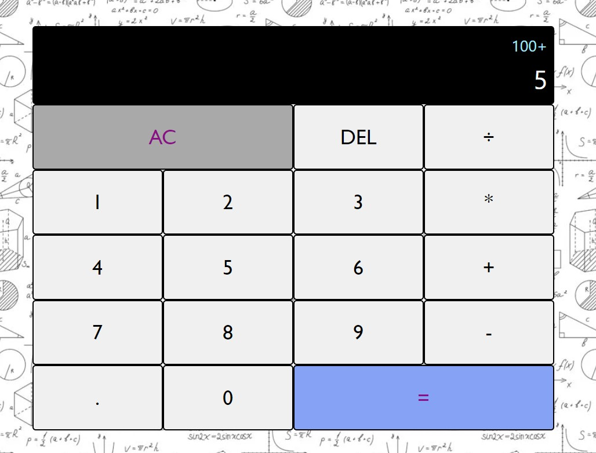

#### This is a web-based calculator application that can perform basic mathematical operations such as:
* addition
* subtraction
* multiplication
* division

#### User can use the online calculator using screen/keyboard buttons.

## Try online [HERE](https://chenmordehai.github.io/calculator/)

## Or download and run:
```
npm run start
```


#### © All Rights Reserved, Chen Mordehai 2023
